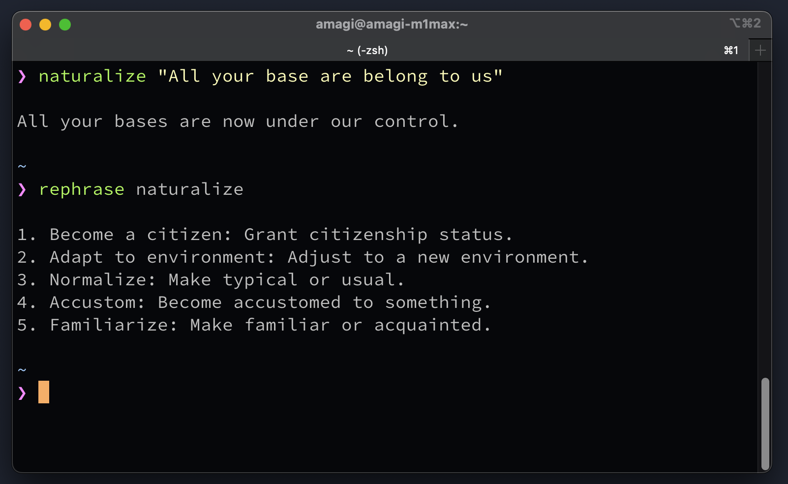

# ChatGPT Language Tutor CLI



This repository contains multiple commands to assist with learning and writing in any language.


## Setup

First, install the commands using npm:
```
npm i -g @fand/chatgpt-english-tutor
```

Then save your OpenAI API key to `~/.config/chatgptenglish` like this:

```
OPENAI_API_KEY=XXXXXXXXXXXXXXXXXXXX
```

Optionally, you can set a default language for all commands:

```
OPENAI_API_KEY=XXXXXXXXXXXXXXXXXXXX
DEFAULT_LANGUAGE=French
```

You can use full language names (French, Spanish, German) or language codes (fr, es, de).

## Usage

### `naturalize`

This command transforms the given text into more natural-sounding text in your target language.

Usage:
```
$ naturalize THE SENTENCE YOU WANT TO NATURALIZE
$ naturalize --lang LANGUAGE THE SENTENCE YOU WANT TO NATURALIZE
$ naturalize -l LANGUAGE THE SENTENCE YOU WANT TO NATURALIZE
```

Examples:
```
# Using default language (English if not configured)
$ naturalize "All your base are belong to us"
All your bases are now under our control.

# Using specific language
$ naturalize -l French "Bonjour je suis étudiant"
Bonjour, je suis étudiant.

$ naturalize --lang Spanish "Hola como estas"
Hola, ¿cómo estás?

# It also supports STDIN inputs
$ echo 'Pipes also work!' | naturalize
Pipes work too!

$ naturalize
> If no arguments are passed, naturalize will read the text input on the terminal.
> The input will be concatenated until a blank line is inserted, then it shows the output.
>
If no arguments are passed, 'naturalize' will read the text input from the terminal. The input will continue to be concatenated until a blank line is inserted, at which point the output will be displayed.
```

### `rephrase`

This command provides multiple rephrasings of the given text in your target language.

Usage:
```
$ rephrase "TEXT TO REPHRASE" [COUNT]
$ rephrase --lang LANGUAGE "TEXT TO REPHRASE" [COUNT]
$ rephrase -l LANGUAGE "TEXT TO REPHRASE" [COUNT]
```

Examples:
```
# Using default language (English if not configured)
$ rephrase "I am happy" 3
1. I feel joyful: Expressing a state of happiness
2. I'm pleased: More formal way of expressing satisfaction
3. I'm delighted: Stronger emphasis on positive emotion

# Using specific language
$ rephrase -l French "Je mange une pomme" 3
1. Je suis en train de manger une pomme: Emphasize the ongoing action
2. Je me restaure: Formal way of saying eating
3. Je prends un repas: Literally means "I'm having a meal"

# Default count is 5 if not specified
$ rephrase "Hello"
1. Hi: Informal greeting
2. Good day: Formal daytime greeting
3. Greetings: Very formal salutation
4. Hey: Casual greeting
5. Salutations: Extremely formal greeting
```

## Author

AMAGI ([GitHub](https://github.com/fand), [Threads](https://www.threads.net/@amagitakayosi))


## LICENSE

MIT
